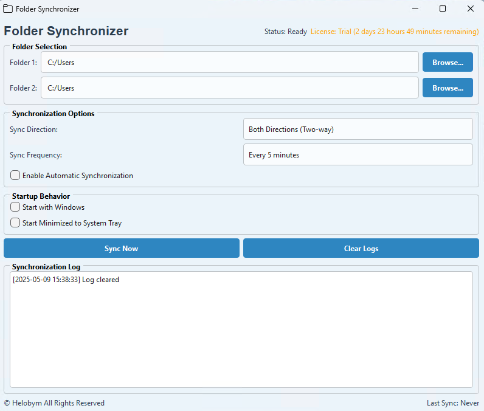

This software is developed by [Helobym](https://helobym.com)

Folder Synchronizer is a Windows desktop application that helps users keep the contents of two folders perfectly in sync with each other. This intuitive tool allows users to select any two folders on their computer or network drives and maintain identical copies of files between them, ensuring data consistency and backup.

[Demo Video](https://youtu.be/6e7Zsi3zcdQ)

